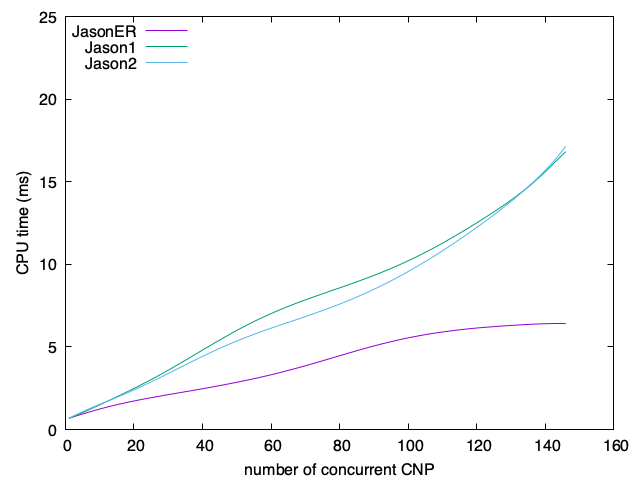

# Experiment to evaluate JasonER vs Jason

## Objective

- Evaluate the scalability of JasonER
- Evaluate the overhead of new features

## Scenario

Contract Net Protocol (CNP) is used to evaluate. We run several CNP concurrently and CPU time required to finish all them is measured.

It is expected that the required time increases linearly (so that is scales well).

It is expected a minimal overhead against Jason due to goal condition (GC). These conditions have to be verified every reasoning cycle.

## Method

Three MAS application are considered and compared:
- JasonER: the initiator of CNP uses JasonER features (sub-plans, goal condition, ...)
- Jason1: the initiator of CNP uses Jason1 features (events)
- Jason2: the initiator of CNP uses Jason2 features (`.wait(<expression>)`)

Each MAS has 1 initiator and 11 participants.

We vary `N` (number of concurrent CNPs) from 1 to 150 and repeat several times to collect enough data.

## Results

The results are:

1. JasonER scales linearly
2. JasonER is faster

as shown in the following graph.

Although the first result is expected, the second is a surprise.

Jason1 is slow because, while sending the CFP, the `+propose/refuse` plans are relevant even if (for sure) not applicable yet -- they can be applicable only after the last CPF was sent. Jason1 `!contract` goal needs to be singleton for a CNP, so it needs to test other intentions using `.intend`. This internal action complexity is `O(n)` (n=number of intentions). So as more intention we have, slower is `.intend`.

Jason2 is slow because of `.wait(<expression>)` that needs to check the expression every event. It does so, however, only after all CFP are sent.

JasonER is faster because:
- `+propose/refuse` plans are relevant only when pursuing `bid` goal, so after all CFP have being sent.
- does not use `.wait(<expression>)`.
- although goal-conditions have to be checked every reasoning cycle, it is done  only while pursuing the `bid` goal (as .wait does in Jason2), the test is fast (a simple `false`).
- the plan library considered for looking for relevant plans for `+propose/refuse` events is smaller given the scope of the sub-plans.

## Implementation

We have the following agent programs (.asl):
- `p.asl`, `pn.asl`, `pr.asl`: CNP participant agents (the same code for all applications)
- `c_j1.asl`: Jason implementation of CNP initiator (based on CNP code available in Jason < 2.0). Without .wait(<expression>).
- `c_j2.asl` : Jason implementation of CNP initiator (based on CNP code available in Jason > 2.0). Contains .wait(<expression>).
- `c_er.asl`: JasonER version of CNP initiator
- `n.asl`: the number of CNPs to run. This file is produced by the scripts and included in c*.asl.

The 3 MAS application files are:
- `cnp-j1.mas2j`: that uses `c_j1.asl`
- `cnp-j2.mas2j`: that uses `c_j2.asl`
- `cnp-er.mas2j`: that uses `c_er.asl`

Some scripts:
- `run*.sh` are used to run MAS with different `N` values, collect CPU time, and store the results in csv files.
- `graph.gnuplot` is used to produce the graph with the results
